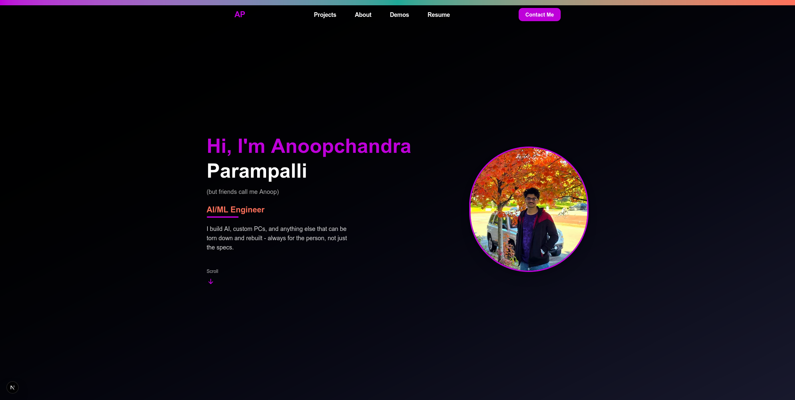
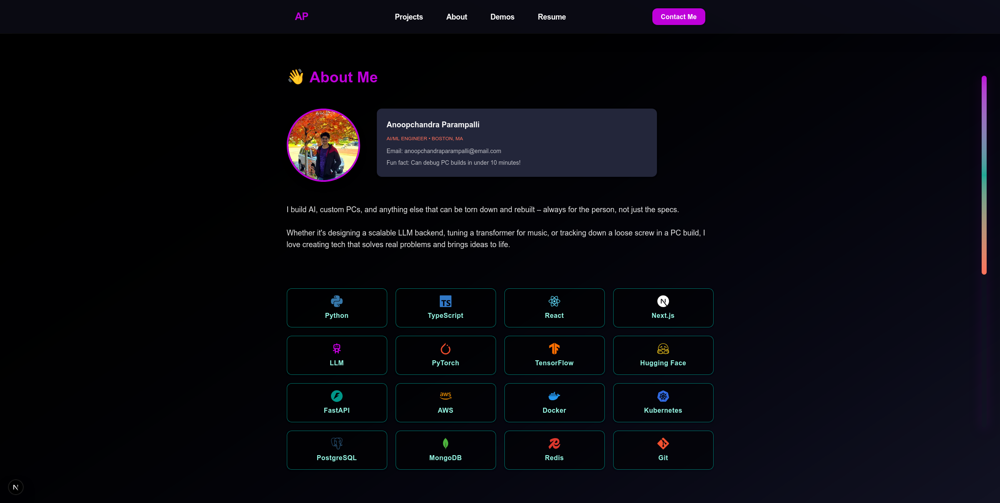
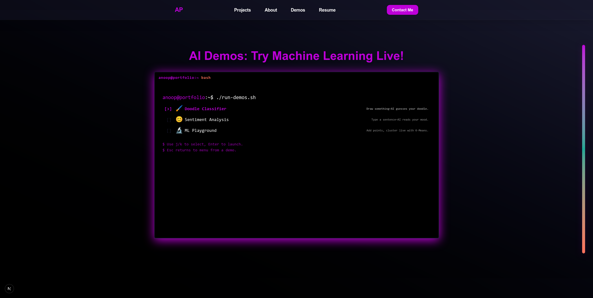

# 🚀 anoopchandra.dev – AI/ML Engineer Portfolio

A modern, interactive portfolio showcasing AI/ML engineering skills through **real, client-side machine learning demos**. Built with Next.js, featuring cinematic animations and hands-on AI experiences that run entirely in your browser.

<div align="center">



[](https://anoopchandra.dev)
[](https://nextjs.org/)
[](https://www.typescriptlang.org/)
[](https://www.tensorflow.org/js)

</div>

---

## ✨ Portfolio Showcase

<details>
<summary>🏠 <strong>Hero Section</strong> - Clean, animated introduction</summary>
<br>

</details>

<details>
<summary>💼 <strong>Featured Projects</strong> - Real-world AI/ML applications</summary>
<br>

</details>

<details>
<summary>👨‍💻 <strong>About Me</strong> - Skills, background, and story</summary>
<br>

</details>

<details>
<summary>🤖 <strong>AI Demos</strong> - Interactive terminal with live ML models</summary>
<br>

</details>

---

## 🚀 Key Features

- **🤖 Interactive AI Demos**: Real machine learning models running client-side
  - **🖌️ Doodle Classifier**: Draw sketches, AI identifies them instantly
  - **😊 Sentiment Analysis**: Type text, get real-time emotion analysis
  - **🔬 ML Playground**: Visual K-means clustering (coming soon)
- **🎨 Modern Design**: Smooth animations with Framer Motion and GSAP
- **⚡ Performance**: Zero cold starts - everything runs in your browser
- **📱 Responsive**: Works seamlessly across all devices
- **♿ Accessible**: WCAG compliant with keyboard navigation
- **💻 Terminal Interface**: Unique CLI-style demo launcher

---

## 🛠️ Tech Stack

### Frontend
- **[Next.js 15](https://nextjs.org/)** - React framework with App Router
- **[TypeScript](https://www.typescriptlang.org/)** - Type-safe development
- **[Tailwind CSS](https://tailwindcss.com/)** - Utility-first styling
- **[Framer Motion](https://www.framer.com/motion/)** - Smooth animations

### AI/ML
- **[TensorFlow.js](https://www.tensorflow.org/js)** - Browser-based ML inference
- **Custom CNN** - Doodle classification (trained on QuickDraw dataset)
- **LSTM Model** - Sentiment analysis (trained on IMDB reviews)

### UI Components
- **[@studio-freight/lenis](https://lenis.studiofreight.com/)** - Smooth scrolling
- **[Lucide React](https://lucide.dev/)** - Icon library
- **Custom components** - Terminal interface, modals, interactive demos

---

## 🎨 Design System

| Color        | Hex       | Usage                    |
|--------------|-----------|--------------------------|
| **Electric** | `#cc00e6` | Primary accent, headings |
| **Coral**    | `#ff715b` | Secondary accent, CTAs   |
| **Teal**     | `#1ea896` | Success states, skills   |
| **Navy**     | `#25283d` | Background gradients     |
| **White**    | `#ffffff` | Text, canvas backgrounds |

---

## 🤖 AI Demo Features

### 🖌️ Doodle Classifier
- **Model**: Custom CNN trained on 50+ QuickDraw categories
- **Input**: 280×280 drawing canvas (mouse/touch)
- **Output**: Top-3 predictions with confidence scores
- **Performance**: Instant inference, no server calls

### 😊 Sentiment Analysis  
- **Model**: LSTM trained on IMDB movie reviews
- **Input**: Text input with CLI-style interface
- **Output**: Positive/Negative sentiment with confidence
- **Features**: Real-time analysis, conversation history

### 🔬 ML Playground
- **Algorithm**: K-means clustering visualization
- **Input**: Interactive point placement
- **Output**: Animated clustering process
- **Educational**: Step-by-step algorithm visualization

---

## 🚀 Quick Start

```bash
# Clone the repository
git clone https://github.com/your-username/anoopchandra-portfolio.git
cd anoopchandra-portfolio

# Install dependencies
npm install

# Start development server
npm run dev

# Build for production
npm run build
npm start
```

Visit [http://localhost:3000](http://localhost:3000) to see the portfolio.

---

## 📁 Project Structure

```
├── app/                    # Next.js App Router
│   ├── layout.tsx         # Root layout with theme provider
│   ├── page.tsx           # Main page with all sections
│   └── globals.css        # Global styles and CSS variables
├── components/            # React components
│   ├── demos/            # AI demo components
│   │   ├── DemoCard.tsx  # Terminal-style demo launcher
│   │   ├── DoodleClassifier.tsx
│   │   ├── SentimentDemo.tsx
│   │   └── PlaygroundDemo.tsx
│   ├── SectionHero.tsx   # Landing section
│   ├── SectionProjects.tsx # Featured projects
│   ├── SectionAbout.tsx  # About me and skills
│   ├── SectionDemos.tsx  # AI demos section
│   ├── Navbar.tsx        # Navigation with smooth scrolling
│   └── ThemeProvider.tsx # Dark theme context
├── hooks/                # Custom React hooks
│   ├── useDoodleModel.ts # CNN model loading and inference
│   ├── useSentimentModel.ts # LSTM model management
│   └── useLenis.ts       # Smooth scroll integration
├── public/               # Static assets
│   ├── models/          # TensorFlow.js model files
│   │   ├── doodle/      # CNN model for sketch recognition
│   │   └── sentiment/   # LSTM model for text analysis
│   ├── projects/        # Project screenshots
│   └── anoopchandra.jpg # Profile photo
└── package.json         # Dependencies and scripts
```

---

## 🎯 Key Sections

### 🏠 Hero
- Animated introduction with typewriter effect
- Professional tagline and contact info
- Smooth scroll indicators

### 💼 Projects
- **Audio Genre Classification**: PyTorch transformer with 85% accuracy
- **Stock Price Prediction**: LLM-powered financial analysis
- **LegalRescue.ai**: Enterprise AI backend (NDA)

### 👨‍💻 About
- Professional background and education
- Technical skills with interactive icons
- Personal story and philosophy

### 🤖 AI Demos
- Terminal-style interface for launching demos
- Real ML models with instant feedback
- Educational explanations for each demo

---

## 🔧 Development

### Model Training
The AI models are trained separately and exported to TensorFlow.js format:
- **Doodle CNN**: Trained on Google's QuickDraw dataset
- **Sentiment LSTM**: Fine-tuned on IMDB movie reviews

Training scripts: [portfolio_models repository](https://github.com/Anoop-Chandra-19/portfolio_models)

### Performance Optimizations
- **Lazy loading**: Demo components load on demand
- **Model caching**: TensorFlow.js models cached after first load
- **Smooth scrolling**: Hardware-accelerated with Lenis
- **Responsive images**: Next.js Image optimization

---

## 🚀 Deployment

Deploy to [Vercel](https://vercel.com/) with zero configuration:

```bash
npm run build
```

The site is optimized for:
- **Edge runtime** for fast global delivery
- **Static generation** for optimal performance  
- **Progressive enhancement** for all device types

---

## 📞 Contact

**Anoopchandra Parampalli**  
AI/ML Engineer • Boston, MA

- 🌐 **Website**: [anoopchandra.dev](https://anoopchandra.dev)
- 📧 **Email**: [anoopchandraparampalli@email.com](mailto:anoopchandraparampalli@email.com)
- 💼 **LinkedIn**: [Connect with me](https://linkedin.com/in/your-profile)
- 🐙 **GitHub**: [View my code](https://github.com/Anoop-Chandra-19)

---

## 📄 License

This project is open source and available under the [MIT License](LICENSE).
