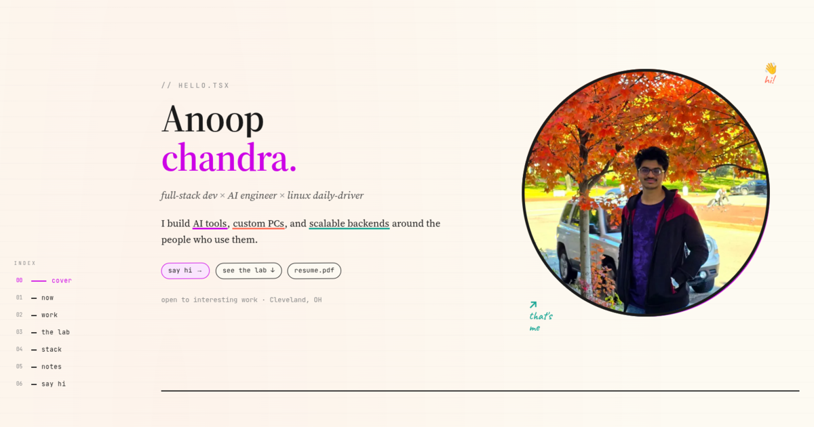

# anoopchandra.dev

My portfolio and engineering journal. It is a statically generated Next.js site with an MDX writing section and a Lab of machine-learning experiments that run entirely in the visitor's browser, with no inference server behind them.

**Live site:** [anoopchandra.dev](https://anoopchandra.dev)



## What was actually hard

### Shipping two neural networks without charging every visitor for them

The Lab runs a doodle classifier and a sentiment model as real TensorFlow.js graph models. TensorFlow.js is by far the heaviest dependency in the project, and the sentiment weights alone are about 9 MB across three shards. A plain top-level import would have put all of that into every page bundle, including pages that never touch a model.

`lib/lab-models.ts` handles the whole lifecycle:

- TensorFlow.js is loaded through a dynamic import, so it stays out of the bundle for every route that does not need it.
- Each model resolves through one shared module-level promise, so concurrent callers and repeat visits across client-side navigation reuse a single load instead of racing.
- Loads try IndexedDB before the network. Persistence is best effort, because private browsing and quota limits should cost a visitor one network fetch, not a broken experiment.
- A dummy `predict` over a zero tensor compiles the WebGL shaders during loading, so the first real classification a visitor triggers is not the one that pays for compilation.
- Progress is reported from the actual fetch, and a failed load clears the shared promise so a retry is possible.

The sentiment tokenizer shipped as a 2.1 MB `word_index.json`, but the model only ever looks up indices below 10,000. `scripts/prune-word-index.mjs` reduces it to 142 KB losslessly, with the original kept as a fallback fetch.

I wrote about this in more detail in [Loading my TensorFlow.js models without loading them everywhere](https://anoopchandra.dev/journal/loading-my-tensorflowjs-models).

### A route transition that neither shimmers nor stalls

Navigation runs a custom ink-bleed animation over the outgoing page. Two details did most of the work:

- Edge noise comes from a seeded mulberry32 PRNG rather than `Math.random()`. Random noise regenerated per frame shimmers; a deterministic sequence gives a stable ragged edge.
- Duration is chosen once at navigate time from the captured viewport and never re-tracked mid-flight. Phone viewports run a shorter version, because desktop timing reads as a stall when there is less screen for the ink to cross.

Geometry lives in `lib/ink-bleed.ts` as pure functions, separate from the React layers that draw it, which makes the timing curves testable in isolation.

### Content that fails the build instead of the page

Journal entries are plain MDX on disk, so nothing stops a typo from reaching production except validation. `lib/journal.ts` is marked `server-only` and validates frontmatter as it loads: malformed metadata, a missing image alternative, or a `related` slug that points at nothing throws with the offending filename and fails the build. Reading times are derived from word count rather than maintained by hand, so they cannot drift from the prose.

## The journal

Nine entries, mostly about things that broke and what the debugging actually looked like. A representative few:

| Entry | About |
| --- | --- |
| [The requests were concurrent. The responses were not.](https://anoopchandra.dev/journal/the-requests-were-concurrent) | Five calls hit the network within a millisecond; four came back together. Transport-level production debugging. |
| [The session expired mid-answer](https://anoopchandra.dev/journal/the-session-expired-mid-answer) | A streamed response that stopped mid-sentence with no error, traced across the stack. |
| [Building fand](https://anoopchandra.dev/journal/building-fand) | Writing a Rust daemon to read and control fan curves from Linux. |
| [Stock Prediction LLM Benchmark](https://anoopchandra.dev/journal/stock-prediction-llm-benchmark) | Eleven language models given identical pre-market evidence. Every one lost money on average. |
| [Audio Genre Classification](https://anoopchandra.dev/journal/audio-genre-classification) | Fine-tuning an Audio Spectrogram Transformer on FMA-Small, served behind FastAPI. |

## Stack

| Area | Technology |
| --- | --- |
| Framework | Next.js 16 App Router, React 19 |
| Language | TypeScript 6 in strict mode |
| Styling | Tailwind CSS 4 and feature-level CSS |
| Content | MDX through `next-mdx-remote`, `gray-matter`, Remark, and Rehype |
| Machine learning | TensorFlow.js graph models running in the browser |
| Motion | CSS, requestAnimationFrame, Lenis, and a custom transition system |
| Observability | Vercel Analytics and Speed Insights |

## Architecture

```text
app/                       Routes, metadata, sitemap, and global style systems
  journal/                 Journal index and statically generated entry routes
  lab/                     Statically generated interactive experiment routes
components/
  journal/                 MDX rendering and journal interaction
  lab/                     TensorFlow.js and algorithm demos
  nav/                     Desktop and mobile navigation
  sections/                Home-page sections
  transition/              Ink transition provider, layers, and animation overlay
  ui/                      Shared interface primitives
content/journal/           Local MDX journal entries
hooks/                     Shared client hooks
lib/
  journal.ts               Server-only content loading and validation
  journal-meta.ts          Serializable journal metadata and display helpers
  lab-meta.ts              Experiment registry shared by routes and the home page
  lab-models.ts            Lazy model loading, progress, caching, and retries
  work-data.ts             Project entries rendered by the work section
  ink-bleed.ts             Pure transition geometry
public/models/             TensorFlow.js manifests, weights, and vocabulary
scripts/                   Maintenance utilities for generated model assets
docs/                      Design and implementation notes
```

Server Components are the default. Interactive behavior sits behind explicit client boundaries, and filesystem-backed journal loading stays server-only. Every journal and lab slug is known at build time and generated statically.

The three Lab experiments are registered in `lib/lab-meta.ts` and rendered at `/lab/<slug>`:

| Slug | Experiment | What it runs |
| --- | --- | --- |
| `doodle` | Doodle Classifier | A TensorFlow.js graph model reading a sketch from a canvas |
| `sentiment` | Sentiment Analysis | A TensorFlow.js text model with a pruned word index |
| `kmeans` | Cluster & Classify | K-Means and perceptron training implemented directly in the browser |

## Running it locally

Next.js 16 requires Node.js **20.9.0 or newer**. This repository uses npm and commits its lockfile.

```bash
git clone https://github.com/Anoop-Chandra-19/anoopchandra-portfolio.git
cd anoopchandra-portfolio
npm ci
npm run dev        # http://localhost:3000
```

```bash
npm run typecheck  # TypeScript compiler check
npm run lint       # ESLint with Next.js Core Web Vitals rules
npm run build      # Production build and static generation
```

Deployment is a standard Next.js production build, hosted on Vercel. No secrets or runtime environment variables are required, since inference and model persistence happen in the visitor's browser.

Journal entries live at `content/journal/<slug>.mdx`, where the filename becomes the route slug. See `AGENTS.md` for the frontmatter contract and repository-specific development guidance.

## License

[MIT](LICENSE)
